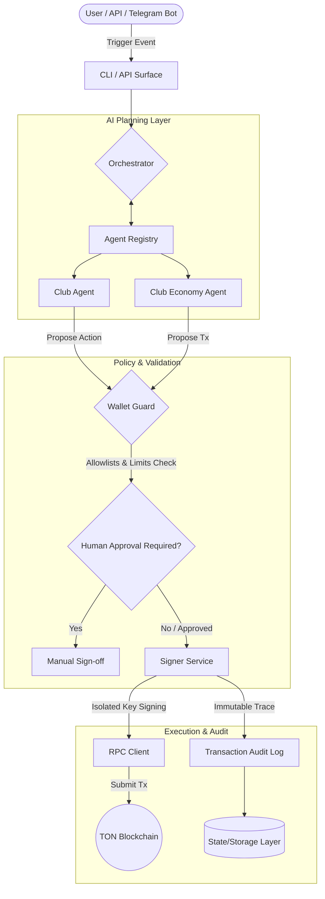

⅙- 👋 Hi, I’m @SwapTokenNFT
- 👀 I’m interested in ...
- 🌱 I’m currently learning ...
- 💞️ I’m looking to collaborate on ...
- 📫 How to reach me .[.]
- (https://swaptoken.club )
- (https://x.com/2misterX)  (https://dorahacks.io/buidl/13438)

# SwapToken-NFT 🤖🌐

## Modular AI-Driven Infrastructure for Web3 Tokenized Communities

  [](https://github.com)
  [](https://python.org)
  [](https://tiangolo.com)
  [](https://ton.org)
  [](https://dorahacks.io)

SwapToken-NFT is a next-generation modular AI Agentic System designed to automate community management ("Clubs"), access control, and tokenized partner economics within the Web3 space. 

By bridging autonomous AI planning with hardened blockchain safety policies (`Wallet Guard`) and isolated transaction signing (`Signer Service`), the platform provides a production-grade infrastructure for automated ecosystem growth, specifically optimized for the **TON (The Open Network)** and **Telegram Mini Apps** ecosystems.

---

## 🗺️ System Architecture

The core pipeline separates intent planning from secure on-chain execution. This prevents AI agents from executing unverified or malicious state mutations.



---

## 🛠️ Tech Stack

- **Core Frameworks:** Python 3.11+, FastAPI, Pydantic v2
- **Data & Caching:** PostgreSQL, SQLAlchemy (Async), Redis
- **Containerization & CI/CD:** Docker, Docker Compose, GitHub Actions
- **Web3 Ecosystem:** TON Blockchain, FunC Smart Contracts, Telegram Bot API
- **QA & Code Quality:** pytest, ruff, mypy

---

## 📁 Repository Structure

```text
swaptoken_nft_agent/
├── config/                     # Environment and application parameters
├── output/                     # Generated reports, state JSON snapshots
├── signer_service.py           # Isolated process handling raw key signatures
└── src/
    ├── main.py                 # Application entrypoint & CLI commands
    ├── orchestrator.py         # Main engine coordinating agents and guards
    ├── agents.py               # AI Agent wrappers (Club & Economy logic)
    ├── tools.py                # Reusable system tools (scrapers, API wrappers)
    ├── wallet_guard.py         # Policy enforcement, daily limits, allowlists
    ├── transaction_audit.py    # Append-only transaction logging engine
    ├── rpc_client.py           # Blockchain RPC gateway for event parsing
    ├── storage.py              # Persistence layer management
    ├── prompts.py              # Structured system prompts for LLM layers
    ├── schemas.py              # Pydantic data validation layer
    └── utils.py                # Helper utilities
```

---

## ⚡ Key Components

### 1. Orchestrator
Acts as the central nervous system. It receives input from the user interface, fetches the current state, assigns tasks to sub-agents, and guarantees sequential pipeline execution.

### 2. Wallet Guard
The critical firewall. It intercepts all blockchain execution queries generated by AI agents. It checks them against predefined policies (e.g., maximum daily transfer limits, strict smart contract allowlists) and flags high-risk actions for manual human sign-off.

### 3. Signer Service
An isolated, security-hardened service containing private keys. Separating transaction generation (AI agents) from actual cryptographic signing (Signer Service) ensures that even if an AI prompt injection occurs, keys remain protected.

### 4. Transaction Audit
Generates a tamper-evident trace of all agent-driven execution plans, simulations, validation passes, and eventual blockchain transmission outcomes.

---

## 🚀 Getting Started

### Prerequisites
- Python 3.11+
- Docker & Docker Compose
- Access to a TON RPC endpoint

### Environment Configuration
Clone the repository and prepare your environment variables:
```bash
cp .env.example .env
```
*Configure database URLs, Telegram API tokens, custom limits for the Wallet Guard, and your isolated Signer credentials in `.env`.*

### Deployment via Docker (Recommended)
```bash
docker compose up --build -d
```

### Local Development
```bash
pip install -r requirements.txt
python -m src.main bootstrap
python -m src.main state
```

---

## 🤖 Available CLI Engine Commands

- `health` — Perform microservice and DB readiness checks.
- `bootstrap` — Initialize required local state models and DB schemas.
- `state` — Load and display current operational metrics.
- `plan` — Process state inputs to generate an AI execution roadmap.
- `guard` — Pass execution payloads through risk-limiting validation arrays.
- `simulate` — Run risk-free transaction simulation on local nodes.
- `submit` — Broadcast cryptographic payload directly to the network.

---

## 🔒 Security Model

- **Zero Direct Trust:** AI agents cannot sign transactions directly.
- **Strict Isolation:** The Signer Service operates inside an isolated process/container layer.
- **Rule Enforcement:** `Wallet Guard` executes deterministic code checks that override any stochastic LLM decisions.
- **Human-in-the-loop (HITL):** Triggers mandatory push-notifications for multi-sig/admin approvals when anomaly thresholds are breached.

---

## 🗺️ Product Roadmap

- [ ] Production-grade Signer Hardening (KMS / HSM Integrations)
- [ ] Direct TON FunC smart contract auto-deployment toolchain
- [ ] Out-of-the-box Telegram Mini App frontend SDK
- [ ] Cross-chain bridge adapters for multi-ecosystem club models
- [ ] Advanced LTV and predictive retention models for tokenized clubs

---

## 👥 Contact & Community

- **Project Lead (X):** [@2misterX](https://x.com)
- **Hackathon Build Profile:** [DoraHacks BUIDL #13438](https://dorahacks.io)
- **GitHub Organization:** [SwapTokenNFT](https://github.com)
- **NFT Showcase:** [Getgems /swaptoken-nft](https://getgems.io)
<!---
SwapTokenNFT/SwapTokenNFT is a ✨ special ✨ repository because its `README.md` (this file) appears on your GitHub profile.
You can click the Preview link to take a look at your changes.
--->
swaptoken_nft_agent/
├── .env.example
├── .gitignore
├── README.md
├── requirements.txt
├── requirements-signer.txt
├── docker-compose.yml
├── Dockerfile.agent
├── Dockerfile.signer
├── config/
│   └── swaptoken_nft_config.json
├── output/
│   ├── audit.log
│   ├── transaction_audit.log
│   ├── state.json
│   └── report.json
├── signer_service.py
└── src/
    ├── init.py
    ├── main.py
    ├── orchestrator.py
    ├── agents.py
    ├── tools.py
    ├── wallet_guard.py
    ├── transaction_audit.py
    ├── rpc_client.py
    ├── storage.py
    ├── prompts.py
    ├── schemas.py
    └── utils.py

    flowchart LR
    U[User] --> CLI[src/main.py]
    CLI --> ORCH[src/orchestrator.py]
    ORCH --> AG[agents.py]
    AG --> WG[wallet_guard.py]
    WG --> TOOLS[tools.py]
    TOOLS --> SIGNER[signer_service.py]
    SIGNER --> AUDIT[transaction_audit.py]
    AUDIT --> STORAGE[storage.py]
    STORAGE --> OUT[output/*]

    flowchart TD
    U[Operator / User] --> CLI[src/main.py
CLI Orchestrator]

    CLI --> CMD{Command}
    CMD -->|health| H[Healthcheck]
    CMD -->|bootstrap| B[Bootstrap State]
    CMD -->|state| S[Load State]
    CMD -->|plan| P[Planning Flow]
    CMD -->|guard| G[Policy Check]
    CMD -->|simulate| SIM[Simulation Flow]
    CMD -->|submit| SUB[Submit Flow]

    subgraph Planning[Planning Layer]
        P --> PA[Product Agent]
        P --> CA[Community Agent]
        P --> COA[Content Agent]
        P --> OA[Onchain Agent]
    end

    subgraph Policy[Policy & Validation]
        G --> WG[wallet_guard.py]
        WG --> ALLOW[Allowlist Check]
        WG --> LIMITS[Amount / Daily Limits]
        WG --> APPROVAL[Human Approval Required?]
    end

    subgraph Execution[Execution Layer]
        SIM --> TOOLS[tools.py]
        SUB --> TOOLS
        TOOLS --> SIGNER[signer_service.py]
        SIGNER --> SIMRES[Simulation Result]
        SIGNER --> TXRES[Submission Result]
    end

    subgraph Audit[Audit & Storage]
        TOOLS --> TA[transaction_audit.py]
        WG --> TA
        SIGNER --> TA
        TA --> LOGS[output/transaction_audit.log]
        CLI --> ST[storage.py]
        ST --> STATE[output/state.json]
        ST --> REPORT[output/report.json]
        CLI --> ALOG[output/audit.log]
    end

    subgraph Config[Configuration]
        CFG[config/swaptoken_nft_config.json] --> CLI
        CFG --> WG
        CFG --> SIGNER
    end

    H --> HEALTH[signer /health]
    B --> STATE
    S --> STATE

    PA --> PLANOUT[Structured Plan]
    CA --> PLANOUT
    COA --> PLANOUT
    OA --> PLANOUT

    PLANOUT --> WG
    APPROVAL -->|No| SIM
    APPROVAL -->|Yes| HOLD[Pending Human Approval]
    HOLD --> SUB

    SIMRES --> SUB
    TXRES --> DONE[Done / Result to Operator]
    **Architecture Overview**

SwapToken-NFT is structured around a core application pipeline, a dedicated Club Agent branch for membership and community operations, and a Club Economy Agent branch for rewards and partner-driven economics. The core pipeline is responsible for orchestration, wallet protection, tool execution, transaction signing, auditing, storage, and output generation. The Club Agent uses the blockchain flow for membership verification and access management, while the Club Economy Agent uses a separate blockchain flow for rewards, redemption, and partner settlement. Shared services are reused across the system to preserve modularity, reduce duplication, and keep the architecture maintainable.
    
## Architecture

The diagram below shows the modular agent structure of SwapToken-NFT v1.

flowchart LR
    A[SwapToken-NFT]

    subgraph M[Membership Layer]
        direction TB
        B[Club Agent]
        D[Verification Service]
        H[Admin & Moderation]
        B --> D
        B --> H
    end

    subgraph E[Economy Layer]
        direction TB
        C[Club Economy Agent]
        R[Reward Engine]
        P[Partner Hub]
        C --> R
        C --> P
    end

    subgraph G[Growth & Control]
        direction TB
        X[Analytics & Growth]
        L[Ledger & Audit]
    end

    A --> B
    A --> C
    A --> X
    A --> L

    D --> L
    R --> L
    P --> L
    H --> L
    X --> L

    subgraph BINT[Club Agent Internals]
        direction TB
        B1[Telegram]
        B2[Web App]
        B3[Partner Portal]
        B4[Membership Layer]
        B5[Community Layer]
        B6[Action Layer]
    end

    B --> B1
    B --> B2
    B --> B3
    B --> B4
    B --> B5
    B --> B6

    subgraph CINT[Club Economy Agent Internals]
        direction TB
        C1[Partner Intake]
        C2[Reward Rules]
        C3[Offer Catalog]
        C4[Economics Layer]
        C5[Partner Analytics]
    end

    C --> C1
    C --> C2
    C --> C3
    C --> C4
    C --> C5

    subgraph DINT[Verification Service Internals]
        direction TB
        D1[On-chain Verification]
        D2[Off-chain Verification]
        D3[Access Policy Engine]
        D4[Status Resolver]
    end

    D --> D1
    D --> D2
    D --> D3
    D --> D4

    subgraph RINT[Reward Engine Internals]
        direction TB
        R1[Reward Rules]
        R2[NFT Reward Minting]
        R3[Coupon / Voucher Logic]
        R4[Redemption Tracking]
    end

    R --> R1
    R --> R2
    R --> R3
    R --> R4

    subgraph PINT[Partner Hub Internals]
        direction TB
        P1[Partner Registry]
        P2[Offer Registration]
        P3[Visit Event Intake]
        P4[Partner Settlement]
    end

    P --> P1
    P --> P2
    P --> P3
    P --> P4

    subgraph XINT[Analytics & Growth Internals]
        direction TB
        X1[Retention Metrics]
        X2[LTV Metrics]
        X3[Campaign Metrics]
        X4[Growth Recommendations]
    end

    X --> X1
    X --> X2
    X --> X3
    X --> X4

    subgraph LINT[Ledger & Audit Internals]
        direction TB
        L1[Access Logs]
        L2[Reward Logs]
        L3[Partner Logs]
        L4[Campaign Logs]
        L5[Security Logs]
    end

    L --> L1
    L --> L2
    L --> L3
    L --> L4
    L --> L5

    classDef core fill:#1e3a8a,stroke:#1d4ed8,color:#ffffff,stroke-width:2px;
    classDef membership fill:#e0f2fe,stroke:#0284c7,color:#0f172a,stroke-width:1px;
    classDef economy fill:#ecfccb,stroke:#65a30d,color:#0f172a,stroke-width:1px;
    classDef growth fill:#f3e8ff,stroke:#a855f7,color:#0f172a,stroke-width:1px;
    classDef control fill:#fff7ed,stroke:#f97316,color:#0f172a,stroke-width:1px;
    classDef internals fill:#f8fafc,stroke:#94a3b8,color:#0f172a,stroke-width:1px;

    class A core;
    class B,D,H membership;
    class C,R,P economy;
    class X,L growth;
    class B1,B2,B3,B4,B5,B6,C1,C2,C3,C4,C5,D1,D2,D3,D4,R1,R2,R3,R4,P1,P2,P3,P4,X1,X2,X3,X4,L1,L2,L3,L4,L5 internals;

flowchart LR
    U[User]

    subgraph CORE[Core Pipeline]
        direction LR
        CLI[src/main.py]
        ORCH[src/orchestrator.py]
        AG[agents.py]
        WG[wallet_guard.py]
        TOOLS[tools.py]
        SIGNER[signer_service.py]
        AUDIT[transaction_audit.py]
        STORAGE[storage.py]
        OUT[output/*]

        CLI --> ORCH --> AG --> WG --> TOOLS --> SIGNER --> AUDIT --> STORAGE --> OUT
    end

    subgraph CLUB[Club Agent]
        direction TB
        CLUB_IN[club/intake.py]
        CLUB_VER[club/verification.py]
        CLUB_MEM[club/membership.py]
        CLUB_COMM[club/community.py]
        CLUB_ACT[club/actions.py]
        CLUB_LOG[club/club_audit.py]

        CLUB_IN --> CLUB_VER --> CLUB_MEM --> CLUB_COMM --> CLUB_ACT --> CLUB_LOG
    end

    subgraph ECON[Club Economy Agent]
        direction TB
        ECON_PARTNER[club_economy/partner_intake.py]
        ECON_RULES[club_economy/reward_rules.py]
        ECON_REW[club_economy/reward_engine.py]
        ECON_CATALOG[club_economy/offer_catalog.py]
        ECON_ANALYTICS[club_economy/partner_analytics.py]

        ECON_PARTNER --> ECON_RULES --> ECON_REW --> ECON_CATALOG --> ECON_ANALYTICS
    end

    subgraph SHARED[Shared Services]
        direction TB
        WG2[wallet_guard.py]
        TOOLS2[tools.py]
        SIGNER2[signer_service.py]
        AUDIT2[transaction_audit.py]
        STORAGE2[storage.py]
    end

    U --> CLI
    ORCH --> CLUB
    ORCH --> ECON

    CLUB_VER --> WG2
    CLUB_ACT --> TOOLS2
    CLUB_LOG --> STORAGE2

    ECON_REW --> SIGNER2
    ECON_ANALYTICS --> AUDIT2
    CLUB_LOG --> STORAGE2
    CLUB_VER --> WG2
    CLUB_ACT --> TOOLS2
    ECON_REW --> SIGNER2
    ECON_ANALYTICS --> AUDIT2

    CLI -. shared .-> WG2
    TOOLS -. shared .-> TOOLS2
    SIGNER -. shared .-> SIGNER2
    AUDIT -. shared .-> AUDIT2
    STORAGE -. shared .-> STORAGE2

    classDef core fill:#1e3a8a,stroke:#1d4ed8,color:#ffffff,stroke-width:2px;
    classDef club fill:#dbeafe,stroke:#2563eb,color:#0f172a,stroke-width:1px;
    classDef economy fill:#dcfce7,stroke:#16a34a,color:#0f172a,stroke-width:1px;
    classDef shared fill:#f3f4f6,stroke:#6b7280,color:#111827,stroke-width:1px;
    classDef storage fill:#fef3c7,stroke:#d97706,color:#111827,stroke-width:1px;

    class CLI,ORCH,AG,WG,TOOLS,SIGNER,AUDIT,STORAGE,OUT core;
    class CLUB_IN,CLUB_VER,CLUB_MEM,CLUB_COMM,CLUB_ACT,CLUB_LOG club;
    class ECON_PARTNER,ECON_RULES,ECON_REW,ECON_CATALOG,ECON_ANALYTICS economy;
    class WG2,TOOLS2,SIGNER2,AUDIT2 shared;
    class STORAGE2 storage;

######### + Blockchain 

     flowchart LR
    U[User]

    subgraph CORE[Core Pipeline]
        direction LR
        CLI[src/main.py]
        ORCH[src/orchestrator.py]
        AG[agents.py]
        WG[wallet_guard.py]
        TOOLS[tools.py]
        SIGNER[signer_service.py]
        AUDIT[transaction_audit.py]
        STORAGE[storage.py]
        OUT[output/*]

        CLI --> ORCH --> AG --> WG --> TOOLS --> SIGNER --> AUDIT --> STORAGE --> OUT
    end

    subgraph CLUB[Club Agent]
        direction TB
        CLUB_IN[club/intake.py]
        CLUB_VER[club/verification.py]
        CLUB_MEM[club/membership.py]
        CLUB_COMM[club/community.py]
        CLUB_ACT[club/actions.py]
        CLUB_LOG[club/club_audit.py]

        CLUB_IN --> CLUB_VER --> CLUB_MEM --> CLUB_COMM --> CLUB_ACT --> CLUB_LOG
    end

    subgraph ECON[Club Economy Agent]
        direction TB
        ECON_PARTNER[club_economy/partner_intake.py]
        ECON_RULES[club_economy/reward_rules.py]
        ECON_REW[club_economy/reward_engine.py]
        ECON_CATALOG[club_economy/offer_catalog.py]
        ECON_ANALYTICS[club_economy/partner_analytics.py]

        ECON_PARTNER --> ECON_RULES --> ECON_REW --> ECON_CATALOG --> ECON_ANALYTICS
    end

    subgraph CHAIN_ACCESS[Blockchain Flow: Access]
        direction TB
        A1[Build access request]
        A2[Wallet Guard]
        A3[Signer Service]
        A4[RPC / Node]
        A5[Membership Contract]
        A6[Receipt / Event Parser]

        A1 --> A2 --> A3 --> A4 --> A5 --> A6
    end

    subgraph CHAIN_REWARDS[Blockchain Flow: Rewards]
        direction TB
        R1[Build reward action]
        R2[Wallet Guard]
        R3[Signer Service]
        R4[RPC / Node]
        R5[Reward / Loyalty Contract]
        R6[Receipt / Event Parser]

        R1 --> R2 --> R3 --> R4 --> R5 --> R6
    end

    subgraph SHARED[Shared Services]
        direction TB
        WG2[wallet_guard.py]
        TOOLS2[tools.py]
        SIGNER2[signer_service.py]
        AUDIT2[transaction_audit.py]
        STORAGE2[storage.py]
    end

    U --> CLI
    ORCH --> CLUB
    ORCH --> ECON

    CLUB_VER --> A1
    CLUB_ACT --> TOOLS2
    CLUB_LOG --> STORAGE2
    A6 --> CLUB_LOG

    ECON_REW --> R1
    ECON_ANALYTICS --> AUDIT2
    R6 --> ECON_ANALYTICS

    CLI -. shared .-> WG2
    TOOLS -. shared .-> TOOLS2
    SIGNER -. shared .-> SIGNER2
    AUDIT -. shared .-> AUDIT2
    STORAGE -. shared .-> STORAGE2

    classDef core fill:#1e3a8a,stroke:#1d4ed8,color:#ffffff,stroke-width:2px;
    classDef club fill:#dbeafe,stroke:#2563eb,color:#0f172a,stroke-width:1px;
    classDef economy fill:#dcfce7,stroke:#16a34a,color:#0f172a,stroke-width:1px;
    classDef chainAccess fill:#ede9fe,stroke:#7c3aed,color:#0f172a,stroke-width:1px;
    classDef chainRewards fill:#fce7f3,stroke:#db2777,color:#0f172a,stroke-width:1px;
    classDef shared fill:#f3f4f6,stroke:#6b7280,color:#111827,stroke-width:1px;
    classDef storage fill:#fef3c7,stroke:#d97706,color:#111827,stroke-width:1px;

    class CLI,ORCH,AG,WG,TOOLS,SIGNER,AUDIT,STORAGE,OUT core;
    class CLUB_IN,CLUB_VER,CLUB_MEM,CLUB_COMM,CLUB_ACT,CLUB_LOG club;
    class ECON_PARTNER,ECON_RULES,ECON_REW,ECON_CATALOG,ECON_ANALYTICS economy;
    class A1,A2,A3,A4,A5,A6 chainAccess;
    class R1,R2,R3,R4,R5,R6 chainRewards;
    class WG2,TOOLS2,SIGNER2,AUDIT2 shared;
    class STORAGE2 storage
swaptoken-nft-mvp-skeleton/
├── .env.example                          # Шаблон конфигурации
├── .pre-commit-config.yaml               # Pre-commit hooks (ruff, mypy)
├── docker-compose.yml                    # PostgreSQL, Redis, Backend, Signer, Telegram Bot
├── pyproject.toml                        # Root monorepo config
├── README.md                             # (можно добавить)
│
├── backend/
│   ├── Dockerfile                        # Backend container
│   ├── pyproject.toml                    # Dependencies: FastAPI, SQLAlchemy, Redis, pytest, ruff, mypy
│   ├── alembic.ini                       # Database migrations config
│   ├── alembic/                          # Migration engine
│   │   ├── env.py                        # Async Alembic environment
│   │   ├── script.py.mako                # Migration template
│   │   └── versions/                     # (auto-generated)
│   │
│   ├── app/
│   │   ├── __init__.py
│   │   ├── main.py                       # FastAPI entry point + lifespan + CORS + exception handlers
│   │   │
│   │   ├── core/
│   │   │   ├── __init__.py
│   │   │   ├── config.py                  # Pydantic Settings (env vars)
│   │   │   ├── exceptions.py            # Domain exception hierarchy (6 classes)
│   │   │   └── logging.py               # Structured logging (structlog)
│   │   │
│   │   ├── db/
│   │   │   ├── __init__.py
│   │   │   ├── base.py                  # SQLAlchemy async engine + session maker
│   │   │   └── models.py                # ORM: PartnerORM, RewardRuleORM, OfferORM, AuditLogORM
│   │   │
│   │   ├── api/
│   │   │   ├── __init__.py
│   │   │   └── rest/
│   │   │       ├── __init__.py
│   │   │       └── routes/
│   │   │           ├── __init__.py
│   │   │           ├── health.py        # /health, /ready, /live
│   │   │           ├── orchestrator.py  # POST /v1/orchestrator/event, GET /events
│   │   │           └── club_economy.py # Подключает agent router
│   │   │
│   │   ├── services/
│   │   │   ├── __init__.py
│   │   │   ├── audit.py                 # AuditService — запись трассы операций
│   │   │   ├── signer_client.py         # HTTP client к изолированному Signer Service
│   │   │   ├── storage.py               # S3/IPFS/local abstraction
│   │   │   └── oracle_client.py         # Price feeds, KYC verification
│   │   │
│   │   ├── orchestrator/
│   │   │   ├── __init__.py
│   │   │   ├── core.py                  # Orchestrator + ExecutionContext — полный pipeline
│   │   │   ├── routing.py               # Agent registry + resolve_agent() + built-in handlers
│   │   │   └── state_manager.py         # Session + Workflow state (in-memory → Redis/PostgreSQL)
│   │   │
│   │   └── agents/
│   │       ├── __init__.py
│   │       │
│   │       ├── ai_supervisor/
│   │       │   ├── __init__.py
│   │       │   └── agent.py             # Fraud scan, Sybil detect, reward audit, anomaly report
│   │       │
│   │       ├── club_agent/
│   │       │   ├── __init__.py
│   │       │   ├── intake.py            # User onboarding, NFT status check
│   │       │   ├── verification.py      # QR, NFT, manual approval verification
│   │       │   ├── membership.py         # Tier transitions (Guest→Member→Premium→Admin)
│   │       │   └── actions.py           # User actions, reward eligibility
│   │       │
│   │       ├── club_economy/            # ✅ УЖЕ БЫЛ ГОТОВ
│   │       │   ├── __init__.py
│   │       │   ├── README.md
│   │       │   ├── api.py
│   │       │   ├── router.py            # 7 endpoints: partners, rules, rewards, offers
│   │       │   ├── dependencies.py      # DI: repo → service
│   │       │   ├── schemas.py           # 12 Pydantic models
│   │       │   ├── service.py           # ClubEconomyService (6 methods)
│   │       │   ├── repository.py        # InMemoryClubEconomyRepository
│   │       │   ├── models.py            # Partner, RewardRule, Offer dataclasses
│   │       │   ├── exceptions.py        # 10 domain exceptions
│   │       │   └── validators.py        # Business validators + allowed enums
│   │       │
│   │       └── wallet_guard/
│   │           ├── __init__.py
│   │           ├── policy.py            # WalletPolicy, PolicyRule dataclasses
│   │           └── validator.py         # WalletGuardValidator — validate() с PolicyRejectedError
│   │
│   └── tests/
│       ├── __init__.py
│       ├── conftest.py                  # pytest-asyncio + AsyncClient fixture
│       ├── unit/
│       │   ├── __init__.py
│       │   ├── test_exceptions.py       # 6 тестов для core exceptions
│       │   ├── test_wallet_guard.py     # 6 тестов для policy + validator
│       │   └── test_club_economy.py     # 8 тестов для partner, reward, offer operations
│       ├── integration/
│       │   ├── __init__.py
│       │   └── test_api.py              # 5 тестов для health, orchestrator, economy endpoints
│       └── e2e/
│           ├── __init__.py
│           └── test_full_flow.py        # Полный MVP flow: intake → partner → rule → reward → execute
│
├── security/
│   └── signer_service/
│       ├── __init__.py
│       ├── main.py                      # FastAPI: POST /sign, GET /health (stub + production modes)
│       └── Dockerfile                   # Изолированный контейнер
│
├── ton/
│   └── smart_contracts/
│       └── nft/
│           ├── nft_collection.fc        # FunC: collection contract (mint, change_owner, getters)
│           ├── nft_item.fc              # FunC: individual NFT (transfer, static data)
│           ├── deploy.py                # Python: deploy + mint scripts (testnet/mainnet)
│           └── README.md                # Build + deploy instructions
│
├── data/
│   ├── __init__.py
│   └── pipeline/
│       ├── __init__.py
│       └── etl.py                       # DataPipeline: ingest → transform → PII clean → export
│
├── sdk/
│   ├── python/
│   │   ├── setup.py
│   │   └── swaptoken_sdk/
│   │       ├── __init__.py
│   │       └── client.py                # Async HTTP client для API
│   └── js/
│       ├── package.json
│       └── src/
│           └── client.js                # JavaScript/Node.js client для API
│
├── frontend/
│   └── telegram/
│       └── bot/
│           ├── __init__.py
│           ├── main.py                  # python-telegram-bot: /start, callbacks, Mini App, webhook/polling
│           └── Dockerfile               # Контейнер для бота
│
├── integrations/                        # (пусто — для будущих интеграций)
├── examples/                            # (пусто — для примеров использования)
│
└── .github/
    └── workflows/
        └── ci.yml                       # GitHub Actions: lint (ruff), format, type-check (mypy), test (pytest + coverage)
# Hi, I’m @SwapTokenNFT 👋

I build backend systems, AI agent workflows, and Web3 products focused on NFTs, tokenized access, and blockchain automation.

- 👀 I’m interested in blockchain, AI agents, backend architecture, token economics, and decentralized product design.
- 🌱 I’m currently learning and building around SwapToken-NFT, Club Agent, Club Economy Agent, and secure signer-based transaction flows.
- 💞️ I’m looking to collaborate on Web3 infrastructure, NFT membership systems, Telegram bots, and production-grade agent orchestration.
- 📫 How to reach me: [X](https://x.com/2misterX) · [DoraHacks](https://dorahacks.io/buidl/13438)

## What I build

- Backend services with FastAPI, Pydantic, SQLAlchemy, Redis, and PostgreSQL.
- AI orchestration pipelines with policy checks, audit trails, and safe execution.
- Blockchain tools for NFT membership, rewards, access control, and transaction signing.
- Telegram-first product experiences for communities and Web3 projects.

## Featured project

### SwapToken-NFT
A modular Web3 project for NFT-based membership, club access, rewards, partner settlement, and blockchain-assisted automation.

- Core pipeline: CLI, orchestrator, agent registry, wallet guard, tools, signer, audit, storage.
- Club Agent: onboarding, verification, membership transitions, community actions.
- Club Economy Agent: partners, reward rules, offers, analytics, settlement.
- Blockchain flow: access requests, reward actions, signer isolation, receipt parsing.

## Stack

FastAPI · Pydantic · SQLAlchemy · Redis · PostgreSQL · Docker · Python · Telegram Bot API · TON · FunC · AI agents · GitHub Actions

## Contact

- X: https://x.com/2misterX
- DoraHacks: https://dorahacks.io/buidl/13438
- GitHub: https://github.com/SwapTokenNFT
